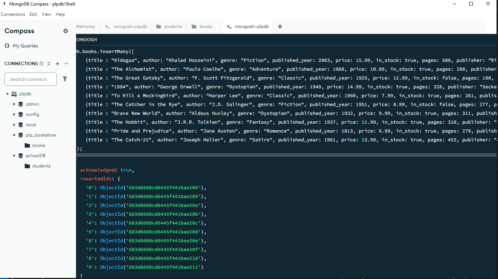

# WEEK 1 ASSIGNMENT
## SET UP
 - initialize node js using `npm init -y `
     this will set up the environment
 - install mongodb using `npm i mongodb`
 - Run the file using `node insert_books.js`

# MongoDB Bookstore Queries

This script contains a series of MongoDB shell commands designed to interact with a database named `plpbookstore` and a collection named `books`. It demonstrates various common MongoDB operations including data insertion, querying, updating, deleting, aggregation, and indexing.

## Prerequisites

Before running this script, ensure you have the following installed and running:

*   **MongoDB Server:** The database server where your data will be stored.
*   **MongoDB Shell (`mongosh`):** The command-line interface used to connect to MongoDB and execute commands.

## How to Run

1.  **Save the code:** Save the provided JavaScript code into a file named `queries.js` (or any other name you prefer) on your computer.
2.  **Open your terminal:** Navigate to the directory where you saved the `queries.js` file using your terminal or command prompt.
3.  **Execute the script:** Run the following command using the MongoDB Shell:

    ```bash
    mongosh queries.js
    ```

    This command will connect to your local MongoDB instance (by default on `mongodb://localhost:27017`) and execute the commands in the `queries.js` file sequentially.

Alternatively, you can connect to your MongoDB instance first using `mongosh` and then paste the contents of the `queries.js` file directly into the shell.

## Script Overview

The script performs the following actions:

*   Switches to or creates the `plpbookstore` database.
*   Inserts 10 sample book documents into the `books` collection.
*   Demonstrates various `find` queries to retrieve data based on criteria.
*   Shows how to `update` documents.
*   Includes a command to `delete` documents.
*   Provides examples of `aggregate` pipelines for data analysis (average price by genre, author with most books, books by publication decade).
*   Creates single and compound `index`es to improve query performance.
*   Uses the `explain()` method to analyze query execution plans.


